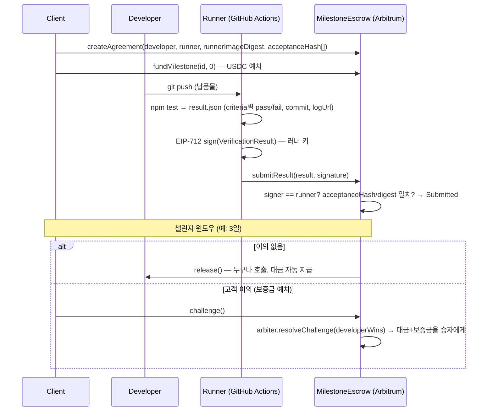

# Proof of Delivery (PoD)

> IT 외주 마일스톤 납품을 중립 러너가 검증하고, 결과가 서명·게시된 뒤 이의 기간이 지나면 스마트 컨트랙트가 대금을 자동 지급하는 검증 기반 정산 프로토콜.

[](https://github.com/yeongchani/proof-of-delivery/actions/workflows/ci.yml)
[](https://github.com/yeongchani/proof-of-delivery/actions/workflows/verify.yml)

**Flow:** 고객 예치 → 개발자 push → GitHub Actions 러너가 테스트 실행 → 결과 JSON을 러너 키로 EIP-712 서명 → 컨트랙트에 제출 → 이의 기간(챌린지 윈도우) → 이의 없으면 자동 지급.

## 1. 흐름



## 2. Live on Arbitrum Sepolia

| 항목 | 값 |
|---|---|
| MilestoneEscrow | _배포 예정 — `npm run deploy:sepolia` 실행 후 `contracts/deployments/arbitrumSepolia.json` 참고_ |
| Token (MockERC20 / USDC) | _배포 예정_ |
| createAgreement tx | — |
| fundMilestone tx | — |
| submitResult tx | — |
| release tx | — |

배포 절차: `.env.example`을 `.env`로 복사해 `ARB_SEPOLIA_RPC`, `DEPLOYER_PRIVATE_KEY`, `USE_MOCK_TOKEN=1`을 채우고 `npm run deploy:sepolia`.
GitHub Actions에 `RUNNER_PRIVATE_KEY`·`ARB_SEPOLIA_RPC`(secrets), `ESCROW_ADDRESS`·`RUNNER_IMAGE_DIGEST`(vars)를 넣으면 `example-deliverable/**` push마다 러너가 실제 체인에 결과를 제출합니다.

## 3. Quick start

```bash
npm ci && npm test && npm run demo
```

Node 20+. `npm test`는 컨트랙트 테스트 9개 + 납품물 인수 테스트 5개 + 러너 단위 테스트를 실행합니다.
`npm run demo`는 in-process Hardhat 네트워크에서 전체 흐름을 약 5초 안에 재현합니다:

```
[1] Deployed MockERC20 … and MilestoneEscrow …; minted 1,000 USDC to client
[2] acceptanceHash = 0xb07f4f64… (keccak256 of canonical example-deliverable/acceptance.json, 5 criteria)
[3] client: createAgreement(id=1, developer, runner, digest=0x3bc1d854…, window=3 days, bond=50, milestones=[300, 200] USDC)
[4] client: approve + fundMilestone(1, 0) — 300 USDC escrowed, state=Funded
[5] runner: ran example-deliverable acceptance tests (vitest) — passed=true, commit=43ab170
      PASS AC-1  health ✓ 16ms
      PASS AC-2  create item ✓ 14ms
      PASS AC-3  rejects missing name ✓ 3ms
      PASS AC-4  get item ✓ 5ms
      PASS AC-5  404 unknown ✓ 2ms
    resultHash 0xa536edec…   EIP-712 signature by runner 0x9a1d79d6…
[6] Submitted. Releasable at 1789479851 (2026-09-15T13:44:11.000Z)
[7] release() before window -> reverted with WindowOpen
[8] evm_increaseTime(3 days + 1s) -> release() -> developer balance = 300.0 USDC
[9] challenge path on milestone 1: fund -> submit -> client challenge (bond 50) -> arbiter resolveChallenge(developerWins=false)
    client refunded 200 + bond 50 back -> client balance = 700.0 USDC

┌───────────┬──────────────┬────────────┬────────────────────────────────────────────────────────────────┐
│ milestone │ amount       │ state      │ outcome                                                        │
├───────────┼──────────────┼────────────┼────────────────────────────────────────────────────────────────┤
│ 0         │ '300.0 USDC' │ 'Released' │ 'auto-released to developer after challenge window'            │
│ 1         │ '200.0 USDC' │ 'Refunded' │ 'challenged, arbiter ruled for client, refund + bond returned' │
└───────────┴──────────────┴────────────┴────────────────────────────────────────────────────────────────┘
```

러너를 단독으로 돌려 보려면 (GitHub Actions `verify.yml`이 하는 일 그대로):

```bash
npm run runner:test    # example-deliverable 테스트 실행 → runner/out/result.json
npm run runner:sign    # RUNNER_PRIVATE_KEY, CHAIN_ID, ESCROW_ADDRESS → runner/out/result.signed.json (env 없으면 skip)
npm run runner:submit  # RPC_URL … → submitResult tx (env 없으면 skip)
```

## 4. How it works

### 마일스톤 상태 머신

| From | Action (who) | To | Guard |
|---|---|---|---|
| Unfunded | `fundMilestone` (client) | Funded | `transferFrom(client, escrow, amount)` |
| Funded | `submitResult` passed=true (anyone, 러너 서명 필수) | Submitted | signer == runner, acceptanceHash·runnerImageDigest 일치 |
| Funded | `submitResult` passed=false | Funded | `VerificationFailed` 이벤트만 — 재작업 |
| Submitted | `release` (anyone) | Released | `now >= submittedAt + challengeWindow` → 개발자에게 지급 |
| Submitted | `challenge` (client) | Challenged | `now < submittedAt + challengeWindow`, 보증금 예치 |
| Challenged | `resolveChallenge(true)` (arbiter) | Released | 대금 + 보증금 → 개발자 |
| Challenged | `resolveChallenge(false)` (arbiter) | Refunded | 대금 + 보증금 → 고객 |

컨트랙트: [`contracts/contracts/MilestoneEscrow.sol`](contracts/contracts/MilestoneEscrow.sol) (OpenZeppelin v5 `Ownable`·`EIP712`·`ECDSA`·`SafeERC20`·`ReentrancyGuard`, 단일 컨트랙트, ERC20 전용).
Custom errors: `NotClient` `NotArbiter` `InvalidState` `BadSigner` `HashMismatch` `DigestMismatch` `WindowOpen` `WindowClosed` `LengthMismatch` `ResultMismatch`.

### EIP-712 typed data (러너가 서명하는 것)

```
Domain: name="ProofOfDelivery", version="1", chainId, verifyingContract
VerificationResult(
  uint256 agreementId,
  uint256 milestoneIndex,
  bytes32 acceptanceHash,      // keccak256(canonical acceptance.json)
  bytes32 commitHash,          // git commit (20 bytes) left-padded to bytes32
  bytes32 runnerImageDigest,   // 고정된 러너 이미지/워크플로 해시
  bytes32 resultHash,          // keccak256(canonical result.json)
  bool    passed,
  uint64  timestamp
)
```

Canonicalization은 한 함수로 통일합니다: [`runner/src/hash.ts`](runner/src/hash.ts) `canonicalHash(obj)` = keccak256(키 재귀 정렬·공백 없는 JSON 바이트). 컨트랙트 테스트·데모·러너가 전부 같은 함수를 씁니다.

### AI 인수기준 변환 출력 형식

향후 SOW/기획서를 LLM으로 변환할 때의 출력 계약은 이미 고정되어 있습니다: [`runner/schema/acceptance.schema.json`](runner/schema/acceptance.schema.json). criteria 하나는 `{ id, tier, desc, test }`이고, `test`는 납품물 테스트 이름과 substring으로 매칭되는 식별자, `tier 1`은 지급 조건, `trigger: all_tier1_pass`가 판정 규칙입니다. 러너 출력은 [`runner/schema/result.schema.json`](runner/schema/result.schema.json)을 따르며, 두 문서의 canonical 해시가 각각 온체인 `acceptanceHash`·`resultHash`가 됩니다.

### 왜 판정을 온체인에서 하지 않나

- 테스트 실행(Node, DB, 네트워크)은 EVM 안에서 불가능하고, 결과 로그를 통째로 올리는 것도 비쌉니다.
- 그래서 체인은 **"누가(러너 키), 무엇을(acceptanceHash·commitHash·resultHash), 어떤 환경에서(runnerImageDigest)"** 판정했는지만 검증하고 기록합니다.
- 판정이 틀렸다면 이의 기간 안에 보증금을 걸고 챌린지 → 중재자가 결정합니다. 판정의 정확성은 오프체인, 정산의 강제력은 온체인.

### 러너 투명성

- `runnerImageDigest`가 계약 생성 시 고정되고, 결과에 다른 다이제스트가 들어오면 `DigestMismatch`로 거절됩니다.
- `result.json`에 `logUrl`(GitHub Actions run URL)과 criteria별 evidence가 들어가고, `resultHash`가 온체인에 남아 사후 대조가 가능합니다. Actions artifact(`verification-result`)로 `result.json`·`result.signed.json`이 보존됩니다.
- 러너 워크플로: [`.github/workflows/verify.yml`](.github/workflows/verify.yml) — 시크릿이 없으면 sign/submit 단계는 "skipped"를 출력하고 성공 종료합니다(fork 환경에서도 green).

## 5. Repo layout

```
pod/
├── package.json                 # npm workspaces: contracts, runner, example-deliverable
├── .github/workflows/verify.yml # 러너 워크플로 (test → sign → submit → artifact)
├── .github/workflows/ci.yml     # npm test + npm run demo
├── contracts/
│   ├── contracts/MilestoneEscrow.sol, interfaces/IMilestoneEscrow.sol, MockERC20.sol
│   ├── test/MilestoneEscrow.test.ts   # 9 tests
│   └── scripts/deploy.ts, demo.ts
├── runner/
│   ├── src/run-tests.ts         # 납품물 테스트 실행 → result.json
│   ├── src/sign.ts              # result.json → EIP-712 서명 → result.signed.json
│   ├── src/submit.ts            # 서명된 결과를 컨트랙트에 제출
│   ├── src/hash.ts, eip712.ts   # canonicalHash / typed data (공용)
│   └── schema/                  # acceptance.schema.json, result.schema.json
└── example-deliverable/         # "납품물" 샘플: Express API
    ├── src/app.ts               # GET /health, POST /items, GET /items/:id
    ├── test/api.test.ts         # 인수기준 = 이 테스트 5개
    └── acceptance.json          # 인수기준 파일 (keccak256이 온체인 acceptanceHash)
```

## 6. What's next

1. **AI 인수기준 변환** — 자연어 SOW/기획서 → `acceptance.json`(criteria·tier·test 매핑) 자동 생성, 양측 서명 후 해시 고정.
2. **이중 리뷰어** — 러너 2곳(예: GitHub Actions + 독립 러너)의 서명이 일치해야 Submitted.
3. **소스 에스크로** — 납품 커밋의 소스 아카이브를 암호화 보관, 지급 완료 시 고객에게 키 공개.
4. **유보금** — 마일스톤별 일부를 하자보수 기간 후 지급하는 2단계 릴리스.
5. **출처 증명 / TEE** — 러너를 TEE에서 실행하고 attestation을 `runnerImageDigest`에 바인딩.

## License

MIT
