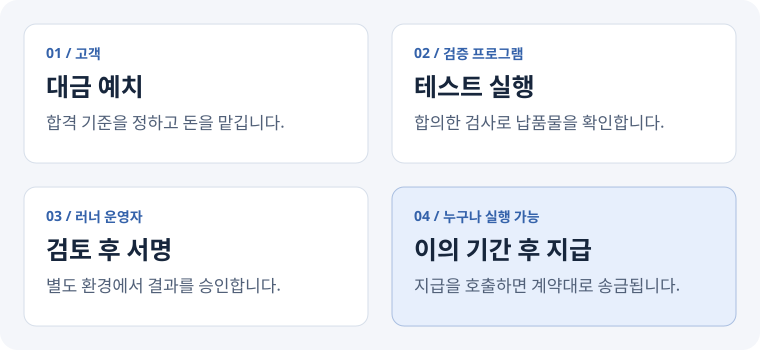

# Proof of Delivery

**외주 개발의 납품 확인과 대금 지급을, 미리 정한 규칙으로 연결합니다.**

[](https://github.com/yeongchani/proof-of-delivery/actions/workflows/ci.yml)
[](LICENSE)

“납품은 했는데 돈을 못 받으면?” “돈을 맡겼는데 개발이 끝나지 않으면?”

PoD는 고객이 대금을 먼저 맡기고, 합의한 테스트로 납품물을 확인하는 프로젝트입니다.
결과를 검토해 서명·제출한 뒤 이의 기간이 지나면, 계약에 정한 금액을 개발자에게 지급할 수 있습니다.

> **현재는 로컬 시연용 프로토타입입니다.** 테스트넷 배포는 아직 하지 않았습니다.
> CI는 서명 없는 검증 결과를 만들며, 실제 정산에는 별도의 결과 검토와 서명이 필요합니다.

[바로 실행하기](#바로-실행하기) · [시연에서 볼 수 있는 것](#시연에서-볼-수-있는-것) · [검증과 한계](#어디까지-믿을-수-있나요) · [기술 문서](docs/verification.md)

## 어떻게 동작하나요?



여기서 **러너**는 테스트를 실행하는 프로그램, **에스크로**는 대금을 보관하는 스마트 컨트랙트입니다.
외주 계약을 나눠 정산하는 각 단계를 **마일스톤**이라고 부릅니다.

고객이 결과에 이의를 제기하면 지급이 멈춥니다. 이때 중재자가 판정합니다.
고객이 이기면 대금과 보증금을 돌려받고, 개발자가 이기면 개발자에게 대금과 고객의 보증금이 지급됩니다.

**기간이 지났다고 저절로 송금되지는 않습니다.** 고객·개발자·봇 등 누구든 `release()`를 호출해야 합니다. 자동 호출 봇은 아직 없습니다.

## 바로 실행하기

Node.js 22 LTS와 Git이 필요합니다. 지갑이나 테스트넷 자금 없이 실행할 수 있습니다.

```bash
git clone https://github.com/yeongchani/proof-of-delivery.git
cd proof-of-delivery
npm ci --ignore-scripts
npm test
npm run demo
```

`npm test`는 계약과 러너의 정상·실패 상황을 검사합니다.
`npm run demo`는 임시 로컬 체인에서 예치부터 지급·환불까지 실행하고 잔액을 보여줍니다. 실행할 때마다 처음부터 시작합니다.

[GitHub에서 테스트 결과 보기](https://github.com/yeongchani/proof-of-delivery/actions/workflows/ci.yml) · [타입 검사: `npm run typecheck`](package.json)

## 시연에서 볼 수 있는 것

샘플 납품물은 상품 등록·조회 기능이 있는 작은 API입니다. 상태 확인, 상품 등록, 잘못된 요청 거절, 상품 조회, 없는 상품 조회를 검사합니다.

| 시나리오 | 진행 | 결과 |
| :--- | :--- | :--- |
| 정상 납품 | 300 예치 → 테스트 통과 → 결과 제출 → 이의 기간 경과 → 지급 호출 | 개발자에게 300 지급 |
| 이의 신청 | 200 예치 → 결과 제출 → 고객이 보증금 50으로 이의 신청 → 중재자가 고객 승으로 판정 | 고객에게 250 반환 |

데모 시작 시 고객 잔액은 1,000, 종료 시 고객 700 · 개발자 300 · 에스크로 0입니다.
모두 **USDC를 흉내 낸 테스트 토큰**입니다. 3일의 대기 시간도 로컬 체인의 시간을 앞당겨 재현합니다.

## 어디까지 믿을 수 있나요?

이번 구현에서 확인하는 것과, 아직 해결하지 못한 것을 나눴습니다.

| 확인하는 것 | 방법 |
| :--- | :--- |
| 합의한 검사 코드인지 | 기준 파일에 테스트 코드·설정의 지문을 포함 |
| 실제로 합격 조건을 충족했는지 | 정확히 하나의 테스트와 매칭, 실행 오류·전체 실패 시 합격 금지 |
| 등록된 러너가 서명했는지 | 컨트랙트에서 서명자와 계약별 기준값 검사 |
| 지급 시점과 금액이 맞는지 | 이의 기간, 상태 전이, 지급·환불 잔액 테스트 |
| 잘못된 계약 설정인지 | 주소·금액·마일스톤 번호·이의 기간 검사 |

**남아 있는 한계**

- 러너를 완전히 신뢰하지 않아도 되는 구조는 아닙니다. 납품 코드는 임의의 프로그램을 실행할 수 있습니다. 코드 지문은 실행 환경이나 결과의 진실성을 증명하지 않습니다.
- 그래서 GitHub 검증 작업에는 서명 키를 넣지 않습니다. 결과와 로그를 검토하고, 납품 코드를 실행하지 않은 별도 환경에서 서명합니다. **CI 초록불 자체가 지급 승인은 아닙니다.**
- 러너나 중재자가 응답하지 않을 때의 기한 만료 환불은 아직 없습니다. 이 경우 돈이 묶일 수 있어 실제 자금 운영용으로 준비된 상태는 아닙니다.

테스트를 통과했다는 것은 **합의한 검사 범위를 만족했다는 뜻**입니다. 납품물 전체의 품질이나 보안을 보증하지는 않습니다.

## 코드를 살펴보려면

| 위치 | 역할 |
| :--- | :--- |
| [`contracts/`](contracts/) | 대금 보관, 지급·환불 규칙, 계약 테스트 |
| [`runner/acceptance/`](runner/acceptance/) | 납품물과 분리한 인수 테스트 |
| [`runner/src/`](runner/src/) | 검증 결과 생성, 검토된 결과 서명, 체인 제출 |
| [`example-deliverable/`](example-deliverable/) | 샘플 API와 합의한 기준 파일 |
| [`.github/workflows/`](.github/workflows/) | 자동 테스트와 서명 없는 검증 결과 보관 |

설치 이후의 자세한 절차는 별도 문서로 옮겼습니다.

- [검증 구조와 서명 절차](docs/verification.md) — 테스트 고정, 결과 검토, 서명 형식, 상태 전이
- [Arbitrum Sepolia 시연 준비](docs/testnet.md) — 배포부터 계약 생성·예치·지급까지

## 다음에 할 일

먼저 테스트넷에서 계약 생성·예치·결과 제출·지급 기록을 공개하고, 기한 만료 환불을 보완할 계획입니다.
이후 독립된 러너의 교차 검증과 더 강한 실행 격리를 검토합니다. AI로 인수 기준을 만드는 기능은 그 다음 단계입니다.

---

[MIT License](LICENSE)
