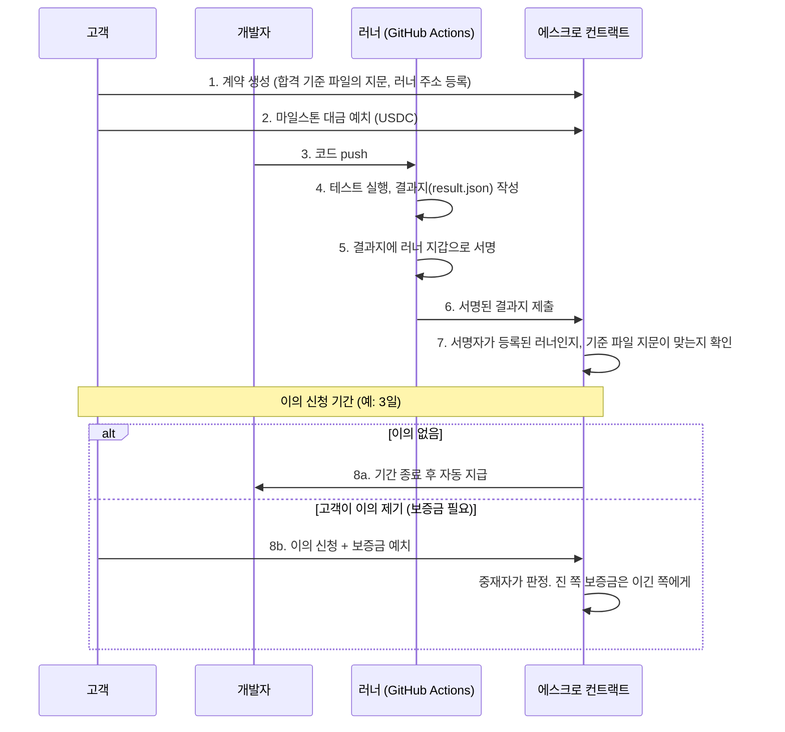
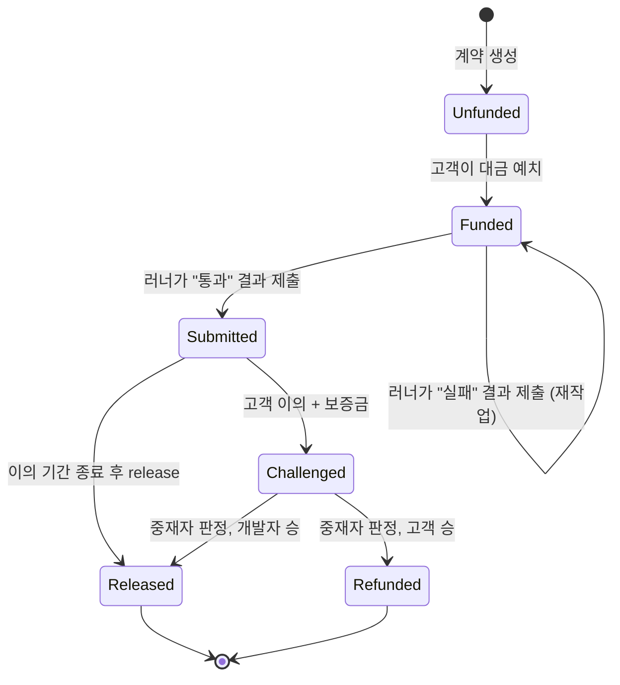

# Proof of Delivery (PoD)

> IT 외주 마일스톤 납품을 중립 러너가 검증하고, 결과가 서명·게시된 뒤 이의 기간이 지나면 스마트 컨트랙트가 대금을 자동 지급하는 검증 기반 정산 프로토콜.

[](https://github.com/yeongchani/proof-of-delivery/actions/workflows/ci.yml)
[](https://github.com/yeongchani/proof-of-delivery/actions/workflows/verify.yml)


**쉽게 말하면,** 외주 개발에서 늘 벌어지는 "돈 먼저냐, 코드 먼저냐" 싸움을 없애는 장치입니다.
고객은 돈을 먼저 맡겨 두고, 개발자는 코드를 올리고, **테스트가 통과하면 정해진 기간 뒤에 돈이 자동으로 나갑니다.**
사람이 "완료됐는지" 판단하지 않습니다. 미리 합의한 테스트 코드가 판단합니다.

---

## 목차

1. [이런 문제를 풉니다](#1-이런-문제를-풉니다)
2. [어떻게 돌아가나](#2-어떻게-돌아가나)
3. [Live on Arbitrum Sepolia](#3-live-on-arbitrum-sepolia)
4. [직접 돌려보기 (3분)](#4-직접-돌려보기-3분)
5. [조금 더 깊게](#5-조금-더-깊게)
6. [폴더 구조](#6-폴더-구조)
7. [다음 단계](#7-다음-단계)

---

## 1. 이런 문제를 풉니다

| 입장 | 지금 겪는 문제 | PoD에서는 |
|---|---|---|
| 개발자 | 납품했는데 돈을 안 준다, 늦게 준다 | 돈은 시작할 때 이미 예치되어 있다. 테스트 통과 + 이의 없음 = 자동 지급 |
| 고객 | 돈은 줬는데 제대로 안 만들었다 | "제대로"의 기준이 테스트 코드로 고정된다. 통과 못 하면 돈이 안 나간다 |
| 둘 다 | "완료"의 기준이 애매해서 싸운다 | 시작 전에 합격 기준 파일을 합의하고, 그 파일의 지문(해시)을 블록체인에 기록한다 |

핵심은 두 가지입니다.

- **판정은 코드가 한다.** 합격 기준 = 테스트 5개. 통과/실패 외에 해석의 여지가 없습니다.
- **정산은 스마트 컨트랙트가 한다.** 사람이 송금 버튼을 누르지 않습니다. 조건이 맞으면 누구든 `release`를 호출해 지급을 실행할 수 있습니다.

---

## 2. 어떻게 돌아가나

등장인물은 넷입니다.

| 역할 | 하는 일 | 비유 |
|---|---|---|
| **고객 (Client)** | 합격 기준을 정하고 돈을 예치한다. 결과가 이상하면 이의를 건다 | 발주처 |
| **개발자 (Developer)** | 코드를 만들어 GitHub에 올린다 | 시공사 |
| **러너 (Runner)** | 코드를 받아 테스트를 돌리고, 결과지에 서명해서 제출한다. GitHub Actions가 이 역할 | 감리 |
| **에스크로 컨트랙트** | 돈을 맡아두고, 서명이 진짜인지 확인하고, 기간이 지나면 지급한다 | 금고 |

이의가 들어왔을 때만 **중재자 (Arbiter)** 가 등장해 판정합니다.



**이의 신청에 보증금이 필요한 이유:** 이유 없이 트집을 잡아 지급을 미루는 것을 막기 위해서입니다. 이의가 기각되면 보증금은 개발자에게 갑니다.

---

## 3. Live on Arbitrum Sepolia

> 테스트넷 배포는 준비 중입니다. 배포 후 아래 표를 채웁니다.

| 항목 | 값 |
|---|---|
| MilestoneEscrow 컨트랙트 | 배포 예정 |
| 토큰 (MockERC20, USDC 역할) | 배포 예정 |
| 계약 생성 tx | - |
| 대금 예치 tx | - |
| 결과 제출 tx | - |
| 자동 지급 tx | - |

<details>
<summary>배포 방법</summary>

1. `.env.example`을 `.env`로 복사하고 `ARB_SEPOLIA_RPC`, `DEPLOYER_PRIVATE_KEY`, `USE_MOCK_TOKEN=1`을 채웁니다.
2. `npm run deploy:sepolia` 를 실행하면 `contracts/deployments/arbitrumSepolia.json`에 주소가 기록됩니다.
3. GitHub 저장소 설정에 secrets(`RUNNER_PRIVATE_KEY`, `ARB_SEPOLIA_RPC`)와 variables(`ESCROW_ADDRESS`, `RUNNER_IMAGE_DIGEST`)를 넣으면, 이후 `example-deliverable/` 아래 코드를 push할 때마다 러너가 실제 체인에 결과를 제출합니다.

</details>

---

## 4. 직접 돌려보기 (3분)

Node.js 20 이상이 필요합니다.

```bash
npm ci && npm test && npm run demo
```

| 명령 | 하는 일 | 걸리는 시간 |
|---|---|---|
| `npm ci` | 의존성 설치 | 약 15초 |
| `npm test` | 컨트랙트 테스트 9개 + 납품물 테스트 5개 + 러너 테스트 5개 | 약 10초 |
| `npm run demo` | 로컬 블록체인에서 전체 흐름을 처음부터 끝까지 재현 | 약 5초 |

데모는 아래 순서로 진행되고, 각 단계마다 한 줄씩 출력합니다.

```
[1] 컨트랙트 배포, 고객에게 1,000 USDC 지급
[2] 합격 기준 파일(acceptance.json)의 지문 계산
[3] 고객: 계약 생성 (마일스톤 2개, 300 + 200 USDC, 이의 기간 3일, 보증금 50)
[4] 고객: 마일스톤 0에 300 USDC 예치
[5] 러너: 납품물 테스트 5개 실제 실행 -> 전부 통과 -> 결과지 서명
      PASS AC-1  health
      PASS AC-2  create item
      PASS AC-3  rejects missing name
      PASS AC-4  get item
      PASS AC-5  404 unknown
[6] 결과 제출 완료. 3일 뒤부터 지급 가능
[7] 바로 지급 시도 -> 거절 (WindowOpen: 아직 이의 기간)
[8] 시간을 3일 앞으로 -> 지급 -> 개발자 잔액 300 USDC
[9] 마일스톤 1로 이의 경로 시연: 예치 -> 제출 -> 고객 이의 -> 중재자가 고객 손 들어줌 -> 고객에게 환불 + 보증금 반환
```

마지막에 요약표가 나옵니다.

| 마일스톤 | 금액 | 최종 상태 | 결과 |
|---|---|---|---|
| 0 | 300 USDC | Released | 이의 없이 기간 경과, 개발자에게 자동 지급 |
| 1 | 200 USDC | Refunded | 고객 이의, 중재 결과 고객 승, 환불 + 보증금 반환 |

| 계정 | 시작 | 끝 |
|---|---|---|
| 고객 | 1,000 | 700 |
| 개발자 | 0 | 300 |
| 에스크로 | 0 | 0 |

<details>
<summary>러너만 따로 돌려보기 (GitHub Actions가 하는 일 그대로)</summary>

```bash
npm run runner:test    # 납품물 테스트 실행 -> runner/out/result.json
npm run runner:sign    # 결과지에 서명 -> runner/out/result.signed.json  (환경변수 없으면 skip)
npm run runner:submit  # 서명된 결과지를 컨트랙트에 제출              (환경변수 없으면 skip)
```

서명과 제출 단계는 `RUNNER_PRIVATE_KEY`, `CHAIN_ID`, `ESCROW_ADDRESS`, `RPC_URL`이 없으면 "skipped"만 출력하고 정상 종료합니다. 그래서 이 저장소를 fork해서 Actions를 돌려도 실패하지 않습니다.

</details>

---

## 5. 조금 더 깊게

### 5-1. 마일스톤은 이 상태들을 지나갑니다



| 상태 | 뜻 |
|---|---|
| Unfunded | 계약은 있지만 아직 돈이 안 들어옴 |
| Funded | 돈이 들어옴. 러너의 결과를 기다리는 중 |
| Submitted | 테스트 통과 결과가 제출됨. 이의 기간 진행 중 |
| Challenged | 고객이 이의를 걸어 잠김. 중재자 판정 대기 |
| Released | 개발자에게 지급 완료 |
| Refunded | 고객에게 환불 완료 |

### 5-2. 컨트랙트는 결과지에서 무엇을 확인하나

러너가 제출하는 결과지에는 아래 정보가 들어가고, 러너 지갑의 서명이 붙습니다.

| 항목 | 뜻 |
|---|---|
| `acceptanceHash` | 합격 기준 파일의 지문. 계약 생성 때 기록한 값과 같아야 함 |
| `commitHash` | 테스트한 코드의 git 커밋. 어떤 코드가 검증됐는지 나중에 확인 가능 |
| `runnerImageDigest` | 러너 실행 환경의 지문. 계약에 등록된 환경에서 돌렸는지 확인 |
| `resultHash` | 결과지 전체의 지문. 결과지가 나중에 바뀌지 않았음을 보장 |
| `passed` | 통과 여부 |

컨트랙트는 세 가지를 검사하고, 하나라도 틀리면 거절합니다.

1. 서명한 지갑이 계약에 등록된 러너인가 (`BadSigner`)
2. 합격 기준 파일 지문이 계약의 것과 같은가 (`HashMismatch`)
3. 러너 실행 환경 지문이 계약의 것과 같은가 (`DigestMismatch`)

<details>
<summary>기술 상세: 서명 형식 (EIP-712)</summary>

EIP-712는 지갑이 "무엇에 서명하는지" 사람이 읽을 수 있는 구조로 서명하는 이더리움 표준입니다. 컨트랙트가 같은 구조로 서명자를 복원해 비교합니다.

```
Domain: name="ProofOfDelivery", version="1", chainId, verifyingContract
VerificationResult(
  uint256 agreementId,
  uint256 milestoneIndex,
  bytes32 acceptanceHash,
  bytes32 commitHash,          // 20바이트 커밋을 32바이트로 왼쪽 패딩
  bytes32 runnerImageDigest,
  bytes32 resultHash,
  bool    passed,
  uint64  timestamp
)
```

지문(해시)은 모두 같은 방식으로 만듭니다. JSON의 키를 정렬하고 공백을 제거한 뒤 keccak256을 취합니다. 이 함수는 [`runner/src/hash.ts`](runner/src/hash.ts) 하나에만 있고, 컨트랙트 테스트·데모·러너가 전부 이 함수를 씁니다.

컨트랙트 코드: [`contracts/contracts/MilestoneEscrow.sol`](contracts/contracts/MilestoneEscrow.sol) (OpenZeppelin v5 사용, 단일 컨트랙트, ERC20 토큰 전용)

</details>

### 5-3. 왜 테스트를 블록체인 위에서 직접 안 돌리나

- 블록체인 위에서는 Node.js도, 데이터베이스도, 네트워크 호출도 실행할 수 없습니다.
- 그래서 체인에는 "누가(러너), 어떤 코드를(commit), 어떤 기준으로(acceptanceHash), 어떤 환경에서(digest) 검증했고 결과가 무엇인지"만 기록합니다.
- 판정이 틀렸다고 생각하면 이의 기간 안에 보증금을 걸고 이의를 제기하고, 중재자가 결정합니다. **판정의 정확성은 체인 밖에서, 정산의 강제력은 체인 안에서** 담당합니다.

### 5-4. 러너를 어떻게 믿나

| 장치 | 효과 |
|---|---|
| 러너 실행 환경 지문을 계약에 고정 | 다른 환경에서 만든 결과는 `DigestMismatch`로 거절됨 |
| 결과지에 GitHub Actions 실행 로그 URL 포함 | 누구나 테스트가 실제로 돌았는지 로그를 열어볼 수 있음 |
| 결과지 지문을 체인에 기록 | 나중에 결과지를 바꿔치기해도 지문이 달라져 들통남 |
| Actions artifact로 결과지 보존 | `result.json`, `result.signed.json`이 실행마다 저장됨 |

러너 워크플로: [`.github/workflows/verify.yml`](.github/workflows/verify.yml)

<details>
<summary>합격 기준 파일 형식 (향후 AI 변환의 출력 규격)</summary>

합격 기준 파일 [`example-deliverable/acceptance.json`](example-deliverable/acceptance.json)은 이렇게 생겼습니다.

```json
{
  "version": "1",
  "agreement": "example",
  "milestone": 0,
  "criteria": [
    { "id": "AC-1", "tier": 1, "desc": "GET /health returns 200", "test": "health" },
    { "id": "AC-2", "tier": 1, "desc": "POST /items creates item", "test": "create item" }
  ],
  "trigger": "all_tier1_pass"
}
```

- `test`는 납품물의 테스트 이름과 부분 일치로 매칭됩니다.
- `tier: 1`인 항목이 전부 통과해야 지급 조건이 됩니다 (`trigger: all_tier1_pass`).
- 나중에 기획서를 AI로 변환할 때도 이 형식으로 출력합니다. 스키마: [`runner/schema/acceptance.schema.json`](runner/schema/acceptance.schema.json), 결과지 스키마: [`runner/schema/result.schema.json`](runner/schema/result.schema.json)

</details>

---

## 6. 폴더 구조

```
proof-of-delivery/
├── contracts/               스마트 컨트랙트 (Hardhat)
│   ├── contracts/           MilestoneEscrow.sol, MockERC20.sol
│   ├── test/                컨트랙트 테스트 9개
│   └── scripts/             demo.ts (전체 흐름 데모), deploy.ts (테스트넷 배포)
├── runner/                  러너 = 심판 역할 스크립트
│   ├── src/run-tests.ts     납품물 테스트 실행 -> 결과지 작성
│   ├── src/sign.ts          결과지에 서명
│   ├── src/submit.ts        컨트랙트에 제출
│   └── src/hash.ts          지문(해시) 계산, 모든 곳에서 공용
├── example-deliverable/     "납품물" 예시: 작은 Express API
│   ├── src/app.ts           GET /health, POST /items, GET /items/:id
│   ├── test/api.test.ts     합격 기준이 되는 테스트 5개
│   └── acceptance.json      합격 기준 파일
└── .github/workflows/
    ├── verify.yml           러너 워크플로 (테스트 -> 서명 -> 제출)
    └── ci.yml               npm test + npm run demo
```

---

## 7. 다음 단계

이번 프로토타입은 "돌아가는 최소 단위"에 집중했습니다. 다음으로 붙일 것들입니다.

| 순서 | 항목 | 왜 필요한가 |
|---|---|---|
| 1 | 기획서를 합격 기준 파일로 자동 변환 (AI) | 지금은 사람이 `acceptance.json`을 손으로 씀 |
| 2 | 러너 두 곳의 결과가 일치해야 인정 | 러너 한 곳이 뚫리면 거짓 결과가 들어갈 수 있음 |
| 3 | 소스 코드 에스크로 | 지급 완료 전까지 고객이 코드를 못 가져가게, 지급 후엔 확실히 넘기게 |
| 4 | 유보금 | 하자보수 기간이 지난 뒤 잔금 지급 |
| 5 | 러너를 신뢰 실행 환경(TEE)에서 실행 | "이 환경에서 돌았다"는 증명을 하드웨어 수준으로 |

---

## 라이선스

MIT
